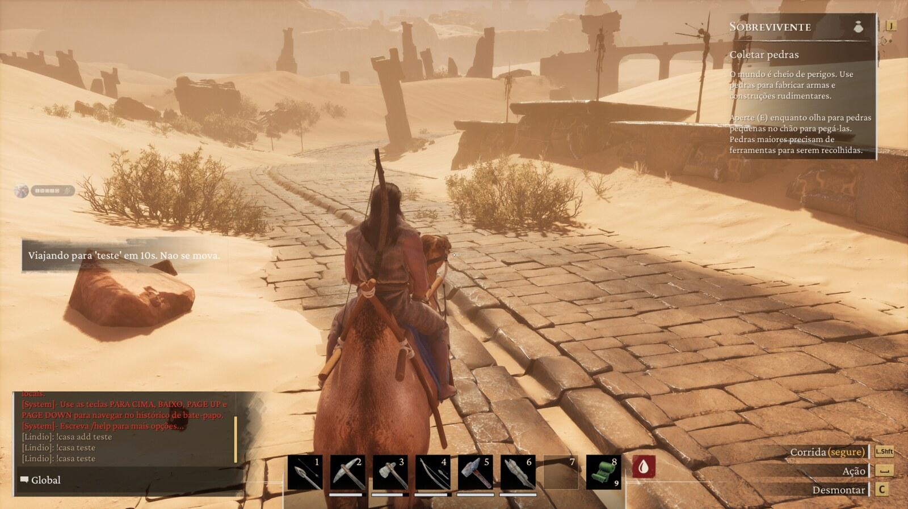
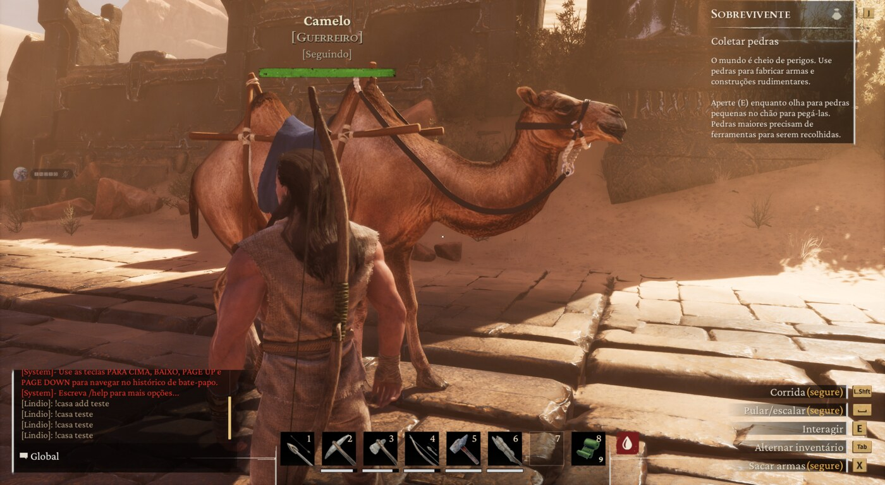

<div align="center">

# 🏠 Conan Homes

### Save a place. Come back to it from anywhere.

**`!home add base`** where you stand. **`!home base`** from the other side of
the map. Your mount comes with you.

<br>

[](https://www.conanexiles.com/)
[](https://github.com/andrew-mauricio/Conan-Api)
[](#building-from-source)
[](LICENSE)

**Server-side only** · unmodified clients · no Workshop item · nothing to download

<br>



<sup>A live server. The countdown is running, and the camel is coming too.</sup>

</div>

<br>

## Why a server wants this

The Exiled Lands are enormous on purpose, and that is most of what makes them
good. It is also what makes a base you built at the north pole somewhere you
visit twice.

Homes gives back the trip without giving away the map: you still had to walk
there once to save it, the return costs a countdown, and a PvP server can make
that countdown long, cancellable and blocked in combat. A private building
server sets the wait to zero and never thinks about it again.

<br>

## Install in three steps

```
1.  Copy the ConanHomes folder into
        <server>\ConanSandbox\Binaries\Win64\Conan-Api\Plugins\

2.  Restart the server — or drop a file named CARREGAR-NOVOS next to
    Conan-Api\Logs\ and it loads without one.

3.  Look for this line in Conan-Api\Logs\ConanApi.log:
        [homes] ready: !home add <name> · !home <name> · !home del <name> · !homes
```

The folder name has a **hyphen** — `Conan-Api`, never run together. Requires
[Conan-Api](https://github.com/andrew-mauricio/Conan-Api) on the server.

<br>

---

## The commands

| in chat | what it does |
|---|---|
| **`!home add <name>`** | saves the spot you are standing on |
| **`!home <name>`** | travels there after a countdown |
| **`!home del <name>`** | forgets it |
| **`!homes`** | lists yours |

> [!IMPORTANT]
> **The prefix is `!`, not `/`.** Conan's client swallows `/command` locally and
> never sends it to the server, so no plugin in any API gets to see it. Measured
> on a live server.

Every command name is configurable, so a Portuguese server runs `!casa add`,
`!casa`, `!casa del` and `!casas` without a line of code changing.

<br>

## `config.json`

```json
{
  "comando": "!home", "comando_lista": "!homes",
  "sub_add": "add",   "sub_remover": "del",
  "permissao": "",

  "max_casas": 5, "espera_seg": 10, "recarga_seg": 60, "combate_seg": 10,

  "levar_montaria": true, "levar_seguidores": true,
  "cancelar_se_levar_dano": true, "bloquear_em_combate": true,

  "custo_add": 0, "custo_viagem": 0, "custo_remove": 0
}
```

| setting | what it does |
|---|---|
| `espera_seg` | the countdown before the trip fires. **Set it to 0** on a building server |
| `recarga_seg` | how long before the player can travel again |
| `cancelar_se_levar_dano` | taking damage during the countdown cancels the trip |
| `bloquear_em_combate` | refuses to start while the player is in combat |
| `permissao` | a [Permission](https://github.com/andrew-mauricio/Conan-Api-SDK) node, or empty for everyone |

The messages players read live in the same file — **translating this plugin is
editing one file**, never the source.

> [!NOTE]
> **The costs are read and nothing is charged.** Conan-Api has no inter-plugin
> points API yet, so there is nothing to charge against. The fields are here so
> that the day there is one, turning charging on is a config edit. The plugin
> says so in the log rather than pretending it took your points.

<br>

---

## How it works

The trip goes through the game's own path:

```cpp
ConanPlayerController::TeleportPlayerServer(
    location, rotation, RunCheatCheck=false, SnapToGround=true, ...)
```

It is **not** the admin one — `AdminTeleportPlayerServer` exists separately,
which is what says this one is meant for ordinary players. `SnapToGround` is the
game solving, for free, the problem every teleport plugin gets wrong on its
first day: a saved Z that is now inside a rock.

`Actor::K2_GetActorLocation` reads the position, and **a position the game did
not answer is never saved**. A home at (0,0,0) would teleport somebody into the
void, so the plugin refuses and says why.

### The countdown, and why it can be cancelled

An instant teleport is an escape button: take a hit, vanish. So the trip is
scheduled, and it dies if the player takes damage or dies while it runs. Both
are configurable, because a PvP server and a building server want opposite
things here.

Combat uses two sources on purpose. `ConanCharacter.HasCombatTarget` is the
game's own flag and costs a field read — but only a hook on
`HandleTakeDamage` catches somebody who **attacked** and was not hit back, which
is exactly the player who would be running.

### It measures itself

`TeleportPlayerServer` returns `void`, which is precisely the situation where a
plugin starts believing its own calls. So the character is asked where it is
afterwards and the distance is logged:

```
[homes] WARNING: asked for (x y z), the character reads (x' y' z')
        right after — N units away.
```

The number is **reported, not judged**: `SnapToGround` moves the player on
purpose and a teleport keeps streaming for a few frames, so a few metres mean
nothing while a few kilometres mean everything. Printing it lets the log settle
that instead of a threshold guessed on the first day.

<br>

## What is proven, and what is not

This section exists because the alternative is a README that reads like a
brochure. Everything below was measured on a live server.

**Proven in game:**

| | |
|---|---|
| saving a position | ✅ read from the game, never invented |
| travelling to it | ✅ several times, with the client's own loading screen |
| taking the mount | ✅ `mount yes`, confirmed on screen |
| the countdown, the cooldown, the messages | ✅ |
| homes surviving a restart | ✅ `loaded 1 home(s) for 1 player(s)` |

**NOT proven — the followers.**

<table>
<tr><td>



</td></tr>
</table>

The pet arrives. It is **not this plugin that brings it** — the log said
`0 follower(s)`, and Conan teleports followers that fall behind on its own. Two
routes were tried and neither found the follower; the cross-check that made that
visible was asking the game first:

```
followers: no formation component — BUT HasAnyFollowingFollowers said yes
```

So the plugin now tries **three** routes in order — the formation component, the
game's own `GetCombatThrallsFromPlayer`, and a sweep of thrall components asking
`IsOwner` — and logs which one answered:

```
[homes] followers: route "library" · 1 found · 1 moved (game says has-followers=yes)
```

**That line has not been seen on a live server yet.** Until it is, followers
arrive because the game brings them, and this plugin claims nothing. If your log
shows a route working, or all three failing, that is the finding — please open
an issue with the line.

Turn `levar_seguidores` off if you would rather the plugin never tried.

<br>

---

## Building from source

You do not need this to use it — the folder ships with the DLL built.

<table>
<tr>
<td width="50%" valign="top">

**Windows**

Open *x64 Native Tools Command Prompt for VS* and run:

```bat
compilar.bat
```

It finds `cl.exe` or `g++` on its own. If the SDK lives elsewhere:

```bat
set CONAN_SDK_INCLUDE=C:\path\to\SDK\include
compilar.bat
```

</td>
<td width="50%" valign="top">

**Linux / WSL**

```bash
./compilar.sh
```

MinGW-w64 cross compiler. No Visual Studio, no Unreal editor, no engine source.

</td>
</tr>
</table>

The build is **reproducible** — `--no-insert-timestamp` keeps the linker from
stamping the clock into the header, so the same source always produces the same
bytes. Build it and compare the hash against the release; without that flag the
check would be theatre.

The DLL depends only on `KERNEL32.dll` and `msvcrt.dll` and exports exactly two
symbols: `ConanPluginCarregar` and `ConanPluginDescarregar`. Nothing of the
API's runtime is compiled in — what crosses the boundary is a plain-C struct of
function pointers, which is why any compiler works.

<details>
<summary><b>Why some names are in Portuguese</b></summary>

<br>

`ConanPluginCarregar`, `LerTextoDoJogo`, `OffsetDoMembro` and friends are part of
Conan-Api's **published ABI**. Renaming them would break every plugin already
compiled against it. Everything this repository owns — comments, docs, log
output, build scripts — is English. The SDK ships a glossary in
`Docs/DEVELOPERS.md`.

</details>

<br>

## Trust model

This plugin runs **inside your server's process**, with everything the server
has: memory, player data, disk, network. There is no sandbox — that is what
"native plugin" means in any game, and pretending otherwise would be worse than
saying it.

It is one file. Read it before you install it, or build it and compare the hash.

**It stores one thing**: a text file of homes — account id, name, three
coordinates. No character names beyond a label, nothing sent anywhere, and a
file you can open and fix by hand.

<br>

## Licence

MIT — see [LICENSE](LICENSE).

<br>

---

<div align="center">

**An independent, community-developed project.**
Not affiliated with, endorsed by, sponsored by, or supported by
Funcom or Inflexion Games.

*Conan Exiles* and all related marks are the property of Funcom.

</div>
